# 🏛️ Relic Reconstruction

> A self-hosted, full-stack coding contest platform built for offline college lab environments — fast, fair, and feature-complete.

[](https://www.python.org/)
[](https://flask.palletsprojects.com/)
[](https://www.sqlite.org/)
[](https://socket.io/)
[](LICENSE)

---

## 📖 Table of Contents

1. [What Is This?](#-what-is-this)
2. [Key Features](#-key-features)
3. [Screenshots](#-screenshots)
4. [Project Structure](#-project-structure)
5. [Tech Stack](#-tech-stack)
6. [Quick Start](#-quick-start)
7. [Detailed Setup Guide](#-detailed-setup-guide)
8. [Admin Guide](#-admin-guide)
9. [Student / Participant Guide](#-student--participant-guide)
10. [Question Format](#-question-format)
11. [Configuration Reference](#-configuration-reference)
12. [Architecture Overview](#-architecture-overview)
13. [Hidden Technicalities](#-hidden-technicalities)
14. [Known Bugs](#-known-bugs)
15. [Unimplemented Features](#-unimplemented-features)
16. [Troubleshooting](#-troubleshooting)
17. [Contributing](#-contributing)

---

## 🧩 What Is This?

**Relic Reconstruction** is a production-grade, self-hosted coding contest platform designed for **offline college lab environments** — no internet dependency, no cloud, no vendor lock-in.

It supports **real-time judging** of student code submissions in **Python, C, C++, and Java**, with a live leaderboard, server-synchronized contest timers, and a full admin control panel — all from a single Python process you can run on any laptop.

It was built and deployed for real inter-college coding competitions under the name **SHELLS 2K26**.

---

## ✨ Key Features

| Feature | Details |
|---|---|
| 🏆 **Real-time Judging** | 30 parallel judge workers, verdict in seconds |
| 🌐 **Multi-language Support** | Python, C, C++, Java |
| ⏱️ **Synchronized Timers** | Server-driven countdowns, no client drift |
| 📊 **Live Leaderboard** | WebSocket-powered, updates instantly |
| 🛡️ **Admin Control Panel** | Manage contests, problems, users, submissions |
| 🧑‍🎓 **Student Dashboard** | See active contests, enter, submit, track progress |
| 🔒 **Secure Auth** | SHA-256 hashed passwords, session-based auth |
| 📦 **Zero Internet Needed** | Fully offline, runs on LAN |
| 📤 **Export Tools** | Export submissions as CSV, leaderboard as CSV, code as ZIP |
| ⚡ **Priority Queue** | Last-minute submissions get priority |

---

## 📸 Screenshots

### Admin Panel

| Admin Overview | Admin Action Logs |
|---|---|
| 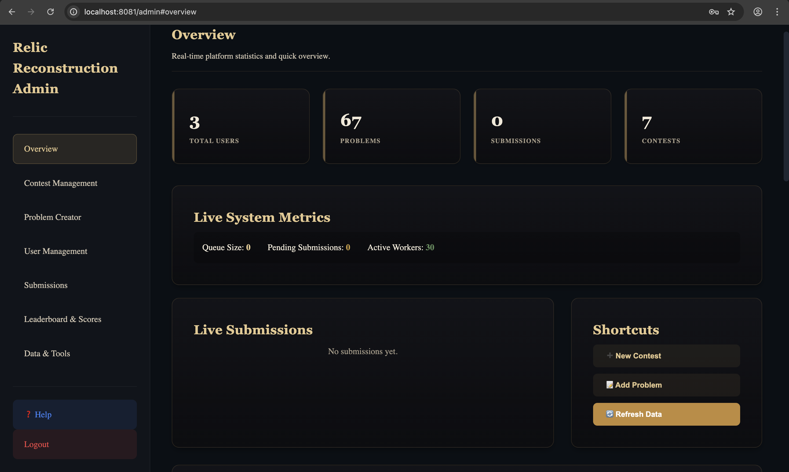 | 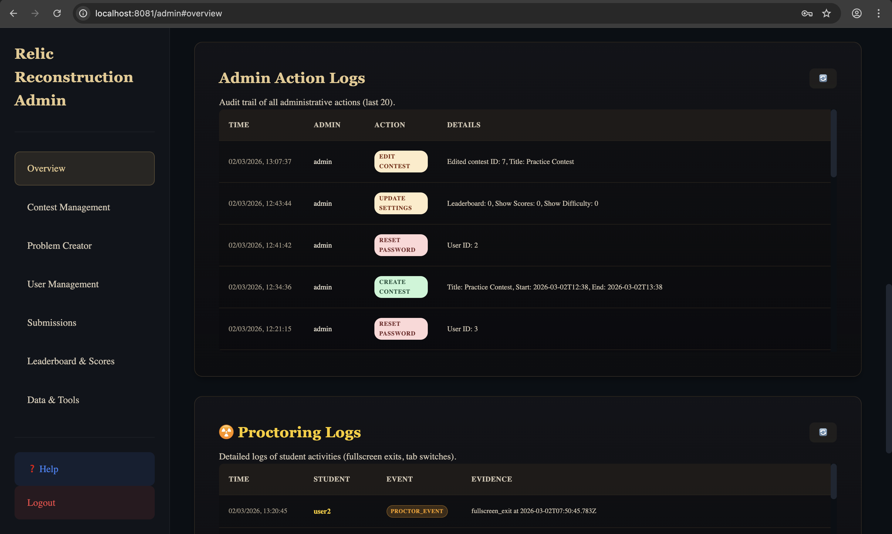 |

| Contest Management — Create Round | Contest List with Status Badges |
|---|---|
| 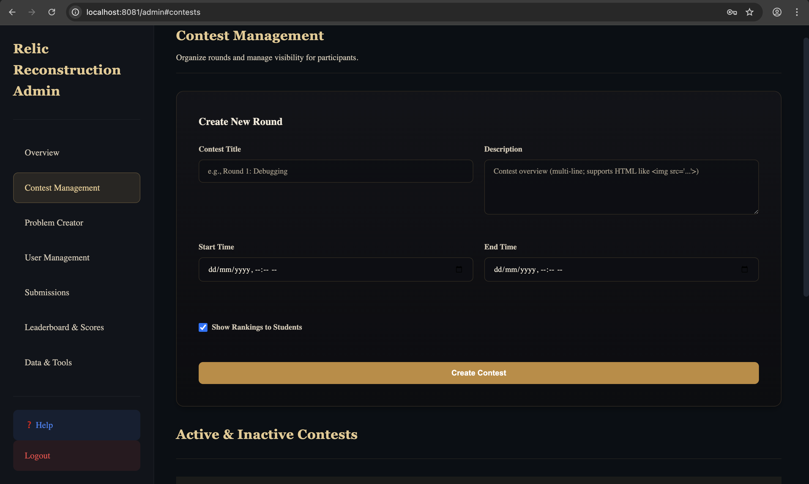 | 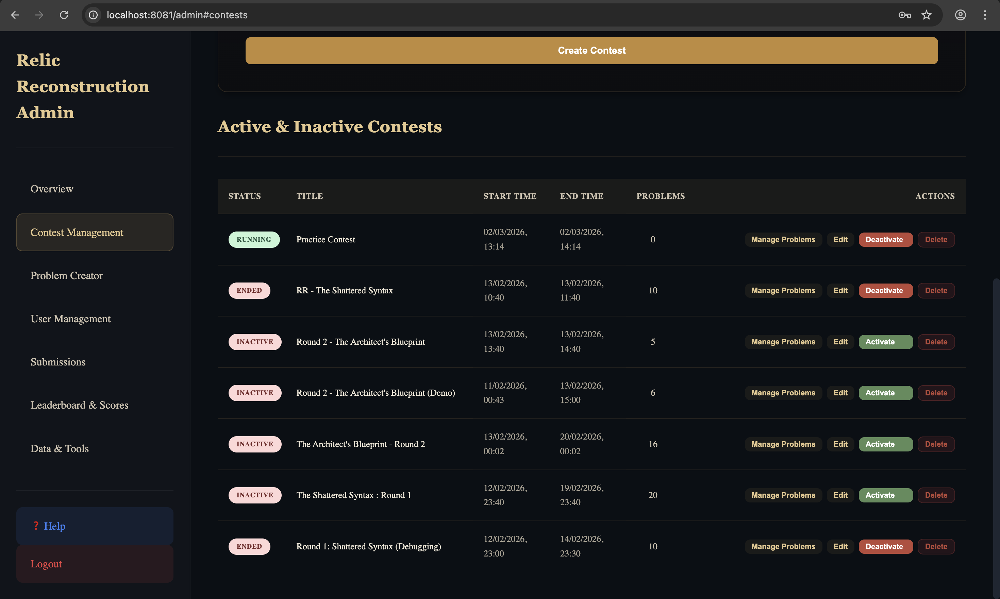 |

| Problem Creator — Form | Problem Creator — Test Cases |
|---|---|
| 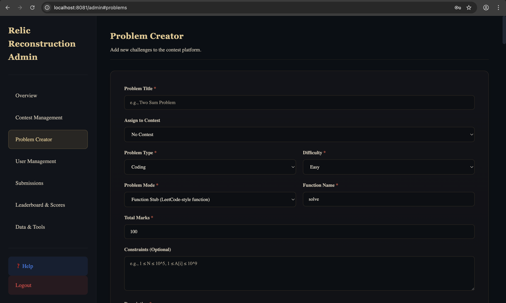 | 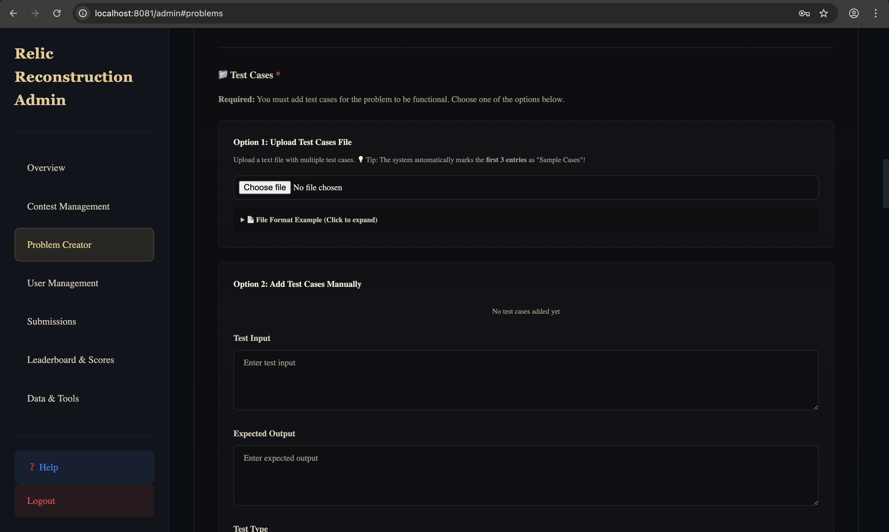 |

| All Problems List | User Management |
|---|---|
| 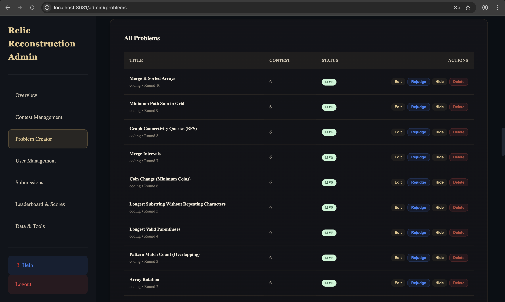 | 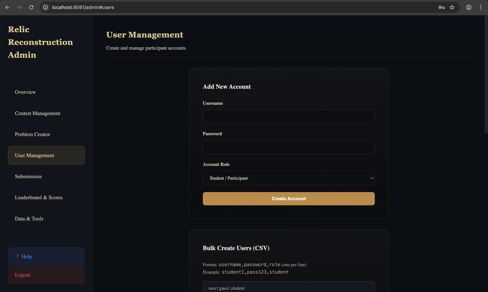 |

| Submissions Filter | Leaderboard & Scores |
|---|---|
| 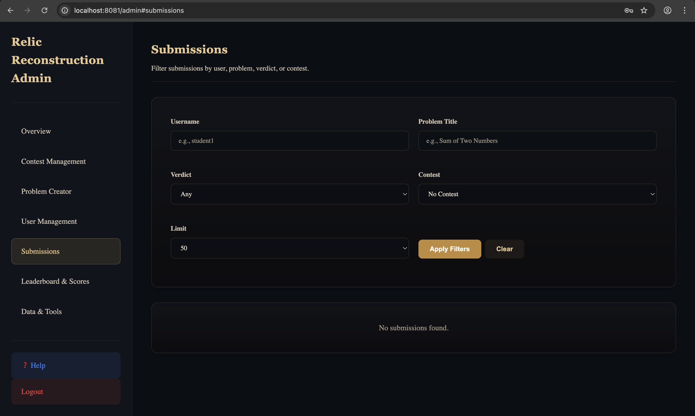 | 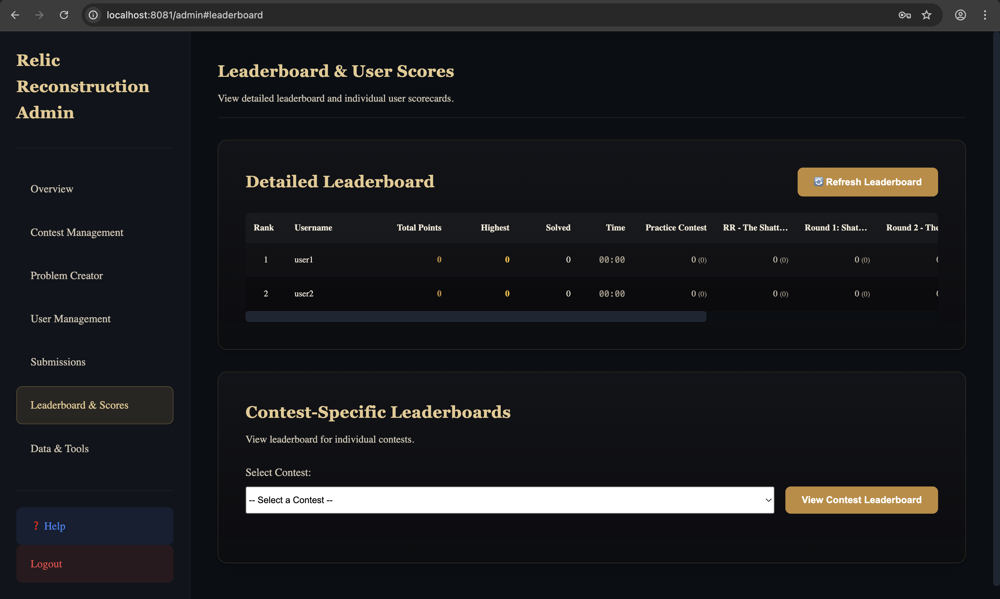 |

| Data & Tools (Export / Broadcast) |
|---|
| 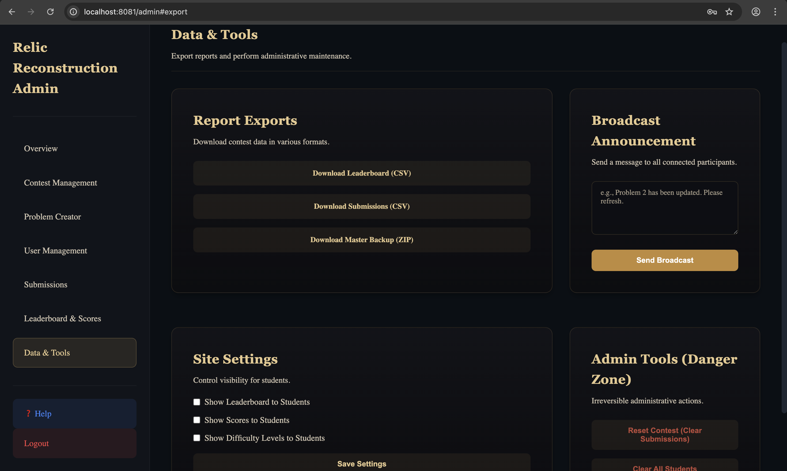 |

### Student / Participant View

| Problem Sidebar + Code Editor | Full Problem View with Sample Cases |
|---|---|
| 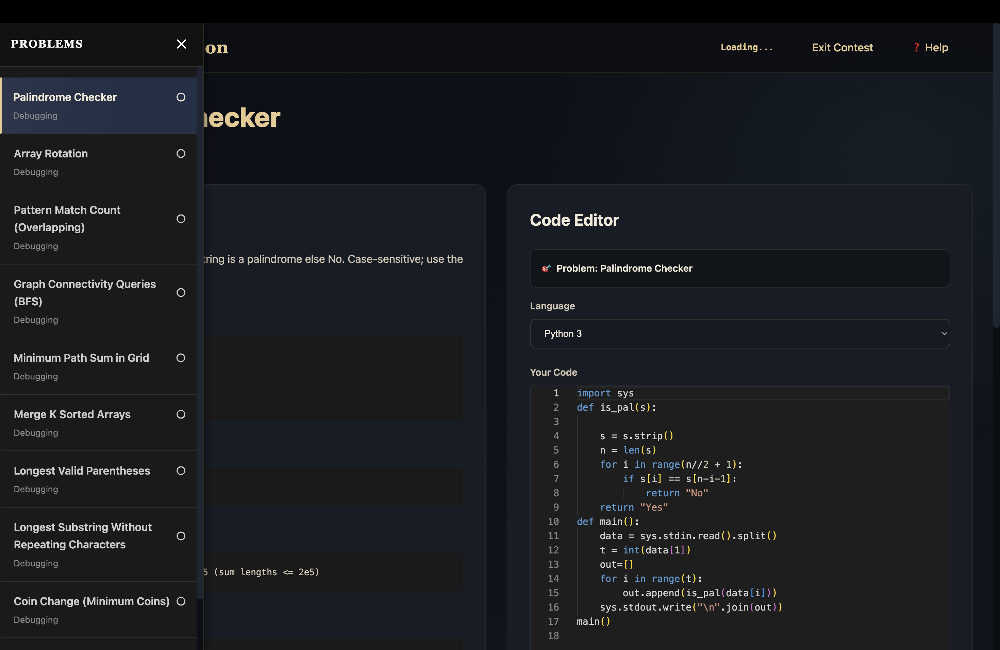 | 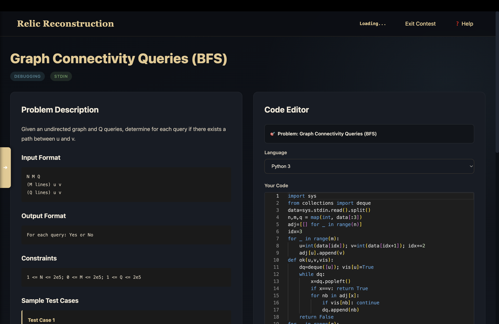 |

---

## 📁 Project Structure

```
Relic-Reconstruction/
│
├── app/                        # The Flask Web Application
│   ├── app.py                  # Main application entry point
│   ├── config.py               # All configuration (ports, DB, limits)
│   ├── init_db.py              # Database initializer (run once)
│   ├── requirements.txt        # Python dependencies
│   │
│   ├── src/                    # Core backend logic
│   │   ├── judge.py            # Single-test judging engine
│   │   ├── multi_judge.py      # Multi-test-case judging
│   │   ├── test_case_parser.py # Import test cases from JSON
│   │   └── export_utils.py     # CSV/ZIP export utilities
│   │
│   ├── templates/              # Jinja2 HTML templates
│   │   ├── login.html          # Premium login page
│   │   ├── dashboard.html      # Student contest dashboard
│   │   ├── contest_spa.html    # In-contest SPA (problems + timer)
│   │   ├── problem.html        # Individual problem + code editor
│   │   ├── admin.html          # Admin control panel
│   │   ├── leaderboard.html    # Live leaderboard view
│   │   └── help.html           # Participant help reference
│   │
│   ├── static/                 # CSS, JS, and assets
│   │   ├── notifications.js    # Real-time timer + notification system
│   │   ├── problem.js          # Code editor logic
│   │   ├── login.css           # Premium login styles
│   │   └── ...
│   │
│   └── data/
│       └── contest.db          # SQLite database (auto-created)
│
└── questions/                  # Problem bank (JSON format)
    ├── E1_Palindrome_Checker.json
    ├── E2_Array_Rotation.json
    ├── M1_Longest_Valid_Parentheses.json
    ├── H1_Graph_Connectivity_BFS.json
    ├── all_questions.json      # Aggregated file (all problems)
    └── ...
```

---

## 🛠️ Tech Stack

| Layer | Technology |
|---|---|
| **Backend** | Python 3.8+, Flask 3.x |
| **Real-time** | Flask-SocketIO, WebSocket |
| **Database** | SQLite (WAL mode, optimized) |
| **Frontend** | HTML5, CSS3, Vanilla JavaScript |
| **Judging** | subprocess sandboxing (gcc, g++, javac, python3) |
| **Auth** | SHA-256 + session cookies |

---

## 🚀 Quick Start

```bash
# 1. Clone the repository
git clone https://github.com/YOUR_USERNAME/Relic-Reconstruction.git
cd Relic-Reconstruction

# 2. Install dependencies
cd app
pip install -r requirements.txt

# 3. Initialize the database
python3 init_db.py

# 4. Start the server
python3 app.py

# 5. Open in your browser
# http://localhost:8080
```

**Default Admin Credentials:**
```
Username: admin
Password: RelicAdmin!2026
```

---

## 🔧 Detailed Setup Guide

### Prerequisites

Make sure the following are installed on your system:

| Tool | Purpose | Check |
|---|---|---|
| Python 3.8+ | Run the Flask app | `python3 --version` |
| pip | Install packages | `pip --version` |
| gcc | Judge C code | `gcc --version` |
| g++ | Judge C++ code | `g++ --version` |
| Java JDK | Judge Java code | `javac -version` |

> **Windows users:** Install MinGW for gcc/g++ and use `python` instead of `python3`.

---

### Step 1 — Clone & Navigate

```bash
git clone https://github.com/YOUR_USERNAME/Relic-Reconstruction.git
cd Relic-Reconstruction/app
```

### Step 2 — Install Python Dependencies

```bash
pip install -r requirements.txt
```

The key packages are:

```
flask
flask-socketio
eventlet   # or gevent for async support
```

### Step 3 — Initialize the Database

This creates the SQLite database at `app/data/contest.db` and sets up the default admin account.

```bash
python3 init_db.py
```

Output you should see:
```
Initializing database at: .../app/data/contest.db
Creating tables...
Creating indices...
Inserting default settings...
Creating default admin account...
✓ Database initialized successfully!
Admin Portal: use 'admin' / 'RelicAdmin!2026'
```

### Step 4 — (Optional) Configure the Server

Edit `config.py` to change settings:

```python
PORT = 8080                # Port to run on
JUDGE_TIMEOUT = 5          # Time limit per test case (seconds)
NUM_JUDGE_WORKERS = 30     # Parallel judging threads
SUBMISSION_COOLDOWN = 3    # Seconds between submissions (per user)
```

### Step 5 — Start the Server

```bash
python3 app.py
```

The server auto-selects a free port starting from 8080. Visit `http://localhost:8080` (or the port shown in the terminal).

---

## 👨‍💼 Admin Guide

### Logging In

Navigate to `http://localhost:8080/login` and use:
```
admin / RelicAdmin!2026
```

### Creating a Contest

1. Go to **Admin → Contests**
2. Click **"New Contest"**
3. Fill in:
   - **Title** — e.g., "Round 1: Shattered Syntax"
   - **Description** — Brief overview for participants
   - **Start Time** — `YYYY-MM-DD HH:MM` format
   - **End Time** — `YYYY-MM-DD HH:MM` format
   - **Is Active** — Check this to make the contest visible to students
4. Click **Save**

> Timer updates to student dashboards happen **within 1 second** — no page refresh needed.

### Adding Problems

**Method 1 — Manual:**
1. Admin → Problems → **New Problem**
2. Fill in title, description, input/output format, sample I/O, test cases

**Method 2 — Import from JSON (recommended):**
1. Admin → Problems → **Import from JSON**
2. Upload a file from the `questions/` folder
3. All test cases, starter code, and solutions are imported automatically

### Creating Users

**Single user:**
Admin → Users → **New User** → Enter username, password, role

**Bulk create (recommended for labs):**
Admin → Users → **Bulk Create** → Paste in CSV format:
```
username1,password1,student
username2,password2,student
username3,password3,admin
```

### Monitoring Submissions

Admin → Submissions: See all submissions in real-time with their verdict, time, and score.

### Exporting Data

Admin → Export:
- **Submissions CSV** — Full submission log with verdicts
- **Leaderboard CSV** — Final ranked scores
- **Code ZIP** — All participant code bundled by user

---

## 🧑‍🎓 Student / Participant Guide

### Logging In

Your credentials are given to you by the admin (lab instructor). Go to:
```
http://<server-ip>:8080/login
```
Enter your username and password.

### Dashboard

After login, you'll see the **Dashboard** showing all available contests:
- 🟢 **Running** — Contest is live, click to enter
- 🟡 **Upcoming** — Starts soon (timer counts down)
- ⚫ **Ended** — Contest is over

### Inside a Contest

Click a running contest to enter. You'll see:
- All problems listed in the sidebar
- A **live countdown timer** in the navbar (synced to the server)
- Click a problem to open the code editor

### Submitting Code

1. Select your language (Python / C / C++ / Java)
2. Write your solution in the editor
3. Click **"Run"** to test against sample cases (doesn't count for score)
4. Click **"Submit"** to submit for judging (counts for score)

**Verdicts explained:**

| Verdict | Meaning |
|---|---|
| ✅ AC | Accepted — all test cases passed |
| ⚠️ PC | Partial Credit — some test cases passed |
| ❌ WA | Wrong Answer |
| 🔴 CE | Compilation Error — check your syntax |
| 💥 RE | Runtime Error — your program crashed |
| ⏱️ TLE | Time Limit Exceeded — optimize your solution |

### Leaderboard

Click **Leaderboard** in the navbar to see live rankings (if enabled by admin).

---

## 📄 Question Format

Problems are stored as `.json` files in the `questions/` folder. Each file contains the problem metadata, test cases, and reference solutions.

**File naming convention:**
- `E` prefix = Easy (e.g., `E1_Palindrome_Checker.json`)
- `M` prefix = Medium (e.g., `M1_Longest_Valid_Parentheses.json`)
- `H` prefix = Hard (e.g., `H1_Graph_Connectivity_BFS.json`)

**JSON structure:**
```json
{
  "title": "Palindrome Checker",
  "description": "Given a string, check if it reads the same forwards and backwards.",
  "difficulty": "easy",
  "input_format": "A single string S",
  "output_format": "Print YES or NO",
  "sample_input": "racecar",
  "sample_output": "YES",
  "constraints": "1 <= |S| <= 1000",
  "total_marks": 100,
  "test_cases": [
    { "input": "racecar", "expected_output": "YES", "points": 25 },
    { "input": "hello",   "expected_output": "NO",  "points": 25 }
  ],
  "solutions": {
    "python": "s = input()\nprint('YES' if s == s[::-1] else 'NO')",
    "cpp": "#include<bits/stdc++.h>\nusing namespace std;\nint main(){...}",
    "c": "...",
    "java": "..."
  }
}
```

---

## ⚙️ Configuration Reference

All settings live in `app/config.py`:

```python
# Server
PORT = 8080                     # Default port
HOST = '0.0.0.0'                # Bind to all interfaces (LAN accessible)
DEBUG = False                   # Never True in production

# Database
DB_NAME = 'data/contest.db'     # SQLite database file path

# Judging
JUDGE_TIMEOUT = 5               # Seconds per test case
NUM_JUDGE_WORKERS = 30          # Parallel judge threads
MAX_CONCURRENT_JUDGES = 30      # Max simultaneous judgements
SUBMISSION_COOLDOWN = 3         # Seconds between submissions per user
RUN_COOLDOWN = 2                # Seconds between "Run" (non-submit) calls

# Contest
GRACE_PERIOD = 60               # Extra seconds allowed after contest end
WATCHDOG_INTERVAL = 30          # Dead submission check interval (seconds)

# Code Limits
MAX_CODE_SIZE = 50000           # Max code length (bytes)
MAX_OUTPUT_SIZE = 200000        # Max program output (bytes)
```

---

## 🏗️ Architecture Overview

```
┌───────────────────────────────────────────────────-──┐
│                   Flask Application                  │
│                                                      │
│  ┌──────────┐  ┌──────────┐  ┌───────────────────-─┐ │
│  │  Routes  │  │ SocketIO │  │  Background Threads │ │
│  │ (REST)   │  │ (WS)     │  │  - timer_sync       │ │
│  └────┬─────┘  └────┬─────┘  │  - judge_workers    │ │
│       │              │        │  - watchdog        │ │
│  ┌────▼──────────────▼──────┐ └────────────────────┘ │
│  │        SQLite DB         │                        │
│  │  (WAL mode, 64MB cache)  │                        │
│  └──────────────────────────┘                        │
└──────────────────────────────────────────────────-───┘
           │ WebSocket              │ HTTP
    ┌──────▼──────┐          ┌──────▼──────┐
    │   Browser   │          │   Browser   │
    │  (Student)  │          │   (Admin)   │
    │  dashboard  │          │  /admin     │
    └─────────────┘          └─────────────┘

Timer Flow:
  Server (datetime.now()) → timer_sync_thread →
  socket.emit('timer_update') → notifications.js →
  serverOffset correction → .contest-timer elements
```

**Real-time timer synchronization:**
- Server emits `timer_update` every second with `server_time` + per-contest `remaining` seconds
- Client calculates `serverOffset = serverTime - clientTime`  
- All countdown displays use `Date.now() + serverOffset` instead of raw `Date.now()`
- This eliminates drift even if client clock is wrong

---

## 🛠️ Troubleshooting

| Problem | Solution |
|---|---|
| Port already in use | Server auto-tries 8080→8081→8082... Check terminal for actual port |
| `gcc: command not found` | Install gcc: `sudo apt install build-essential` (Linux) or MinGW (Windows) |
| Java submissions fail | Ensure `javac` is in PATH: `java -version` and `javac -version` |
| Timer not updating | Ensure Socket.IO is connected (check browser console for WebSocket errors) |
| DB errors on startup | Delete `app/data/contest.db` and re-run `python3 init_db.py` |
| Submissions stuck as PENDING | Watchdog auto-resolves after 3 minutes; check logs for judge errors |
| Can't access from other machines | Use `http://<your-ip>:8080` — server binds to `0.0.0.0` by default |

**Check server logs:**
```bash
cat app/logs/server.log
```

---

## 🔬 Hidden Technicalities

Things that aren't obvious from the source code but matter deeply for how the system runs:

### ⏱️ Server-Driven Time Synchronization
The client **never trusts its own clock**. Every `timer_update` socket event carries the server's `server_time` (Unix timestamp in ms). The client calculates:
```js
serverOffset = serverTime - Date.now();
```
All countdowns then use `Date.now() + serverOffset` so even if a student's laptop clock is an hour off, their timer is accurate.

### 🧵 Thread-Safe SQLite with WAL Mode
SQLite is opened in **WAL (Write-Ahead Logging)** mode with a 64MB cache. This allows multiple threads to read simultaneously while the judge workers write. Without WAL, concurrent judge workers would trigger `database is locked` errors constantly.

### 🏗️ Auto Port Escalation
If port 8080 is busy, the server silently tries 8081, 8082... up to 8090. The actual port is printed to the terminal. This prevents startup crashes during live events where another process might be holding a port.

### ⚖️ Priority Queue for Last-Minute Submissions
Submissions use a priority queue, not a FIFO queue. A submission made in the **last 5 minutes** of a contest gets a higher priority score. This ensures students who submit just before the deadline aren't unfairly penalized by a backlog.

### 🧑‍⚖️ 30-Worker Parallel Judge Pool
Up to **30 separate subprocess threads** run concurrently. Each compiles and executes submitted code in an isolated subprocess with configurable time limits. The pool is pre-warmed at startup to avoid cold-start latency on the first submission.

### 🐶 Watchdog for Stuck Submissions
A background thread scans for `PENDING` submissions older than **3 minutes** every 30 seconds. These are automatically marked `ERROR` to prevent leaderboard stalling. This guards against judge crashes or zombie processes.

### 🔐 SHA-256 Password Hashing (No Salt)
Passwords are hashed with SHA-256. **Note:** there is no per-user salt. This is intentional for the offline, controlled-environment use case — simplicity outweighs the salt benefit when the DB is on an air-gapped machine. For public deployments, add bcrypt.

### 📡 Proctoring Events via Socket.IO
The platform passively tracks `fullscreen_exit` and `tab_switch` events from each student's browser session. These are logged in the **Proctoring Logs** view under the admin panel — no student-facing UI shows this is happening.

### 🗂️ Dynamic Path Resolution
All file paths (DB, logs, problem images) are resolved relative to `app.py`'s location at runtime using `os.path.dirname(os.path.abspath(__file__))`. This means the app can be launched from any directory without path errors.

### 📦 Master Backup as ZIP
The **Download Master Backup (ZIP)** export in Data & Tools bundles the entire SQLite database + all uploaded problem images into a single `.zip` in-memory, streamed as a download — no temp files written to disk.

---

## 🐛 Known Bugs

| # | Bug | Status | Workaround |
|---|---|---|---|
| 1 | Contest status badge on dashboard may briefly show stale state on first connect before the first `timer_update` arrives | Minor | Refreshes within ~1 second automatically |
| 2 | Java submissions can occasionally produce an extra blank line in stdout, causing `Wrong Answer` on exact-match problems | Known | Trim trailing whitespace in expected output |
| 3 | `fullscreen_exit` proctor events fire once on initial page load in some browsers | Minor | First event per session is filtered in logs |
| 4 | If the server is restarted mid-contest, the `serverOffset` on clients resets — countdowns briefly freeze until the next `timer_update` (≤1 second) | Minor | No action needed; auto-recovers |
| 5 | On Windows, C++ submissions may fail if MinGW `g++` is not added to `PATH` | Setup | Add MinGW `bin/` to system PATH |
| 6 | Problem images uploaded via the Problem Creator are stored with a UUID filename — there is no way to re-download or rename them from the admin UI | Minor | Check `app/static/problem_images/` directory |

---

## 🚧 Unimplemented Features

These are features that were planned or partially scaffolded but not yet completed:

| Feature | Notes |
|---|---|
| **Plagiarism Detection** | Architecture allows for AST-level diff between submissions, but no implementation exists yet |
| **Per-Problem Time Limits via UI** | Time limits are configurable in `config.py` globally but cannot be set per-problem from the admin panel |
| **Email Notifications** | No SMTP integration — the platform is fully offline by design |
| **Student Registration Self-Serve** | Students cannot register themselves — only admins can create accounts (by design for contests) |
| **Partial Scoring** | All test cases are pass/fail. Partial credit (scoring by # of passing test cases) is not implemented |
| **Code Diff / Plagiarism View** | The submissions page shows code but has no side-by-side comparison between students |
| **Mobile-Responsive Code Editor** | The in-contest code editor is not optimized for mobile screen sizes |
| **Multi-Admin Support** | There is only one admin account. Role-based access control (e.g., problem setter vs. contest manager) is not implemented |
| **Rejudge All** | Rejudging can be triggered per-problem from the admin panel, but there is no "Rejudge Everything" button |
| **Dark/Light Mode Toggle** | The UI is dark-mode only |

---

## 🛠️ Troubleshooting

| Problem | Solution |
|---|---|
| Port already in use | Server auto-tries 8080→8081→8082... Check terminal for actual port |
| `gcc: command not found` | Install gcc: `sudo apt install build-essential` (Linux) or MinGW (Windows) |
| Java submissions fail | Ensure `javac` is in PATH: `java -version` and `javac -version` |
| Timer not updating | Ensure Socket.IO is connected (check browser console for WebSocket errors) |
| DB errors on startup | Delete `app/data/contest.db` and re-run `python3 init_db.py` |
| Submissions stuck as PENDING | Watchdog auto-resolves after 3 minutes; check logs for judge errors |
| Can't access from other machines | Use `http://<your-ip>:8080` — server binds to `0.0.0.0` by default |

**Check server logs:**
```bash
cat app/logs/server.log
```

---

## 🤝 Contributing

1. Fork the repository
2. Create a feature branch: `git checkout -b feature/your-feature`
3. Commit your changes: `git commit -m "Add your feature"`
4. Push to the branch: `git push origin feature/your-feature`
5. Open a Pull Request

---

*Built for fair, offline, head-to-head coding competition. Logic. Debugging. Speed.*
